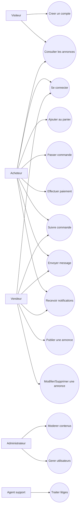
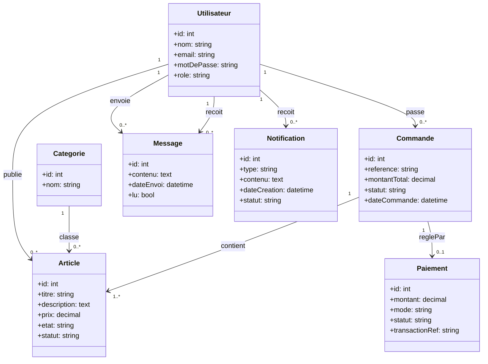
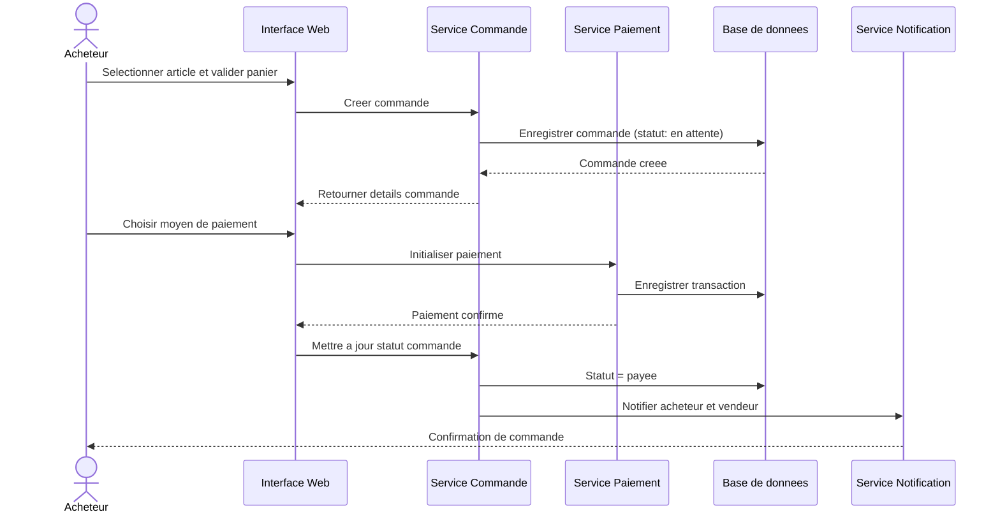
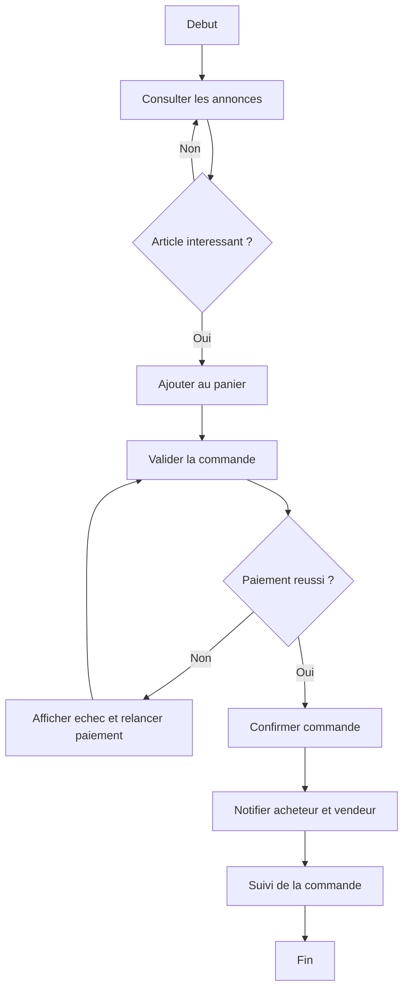

# Conception et developpement d'une plateforme web dediee a la revente des articles d'occasion : cas du marche Manika Kolwezi

## CHAPITRE II : ANALYSE ET CONCEPTION DU SYSTEME

### 2.1 Introduction
Ce chapitre presente l'etude analytique et conceptuelle du systeme propose pour la revente des articles d'occasion dans le contexte specifique du marche Manika a Kolwezi. Il s'agit de partir d'une realite locale, marquee par des echanges majoritairement informels, pour construire un cadre methodologique capable d'orienter une solution numerique credible et durable. L'objectif n'est pas seulement de decrire une idee de plateforme, mais de justifier sa pertinence a partir des difficultes observees sur le terrain, de formaliser les besoins des utilisateurs, puis de proposer une architecture de conception adaptee aux contraintes techniques et socioeconomiques de ce contexte.

### 2.2 Analyse de l'existant
Dans sa forme actuelle, la revente des articles d'occasion au marche Manika repose principalement sur des interactions directes entre vendeurs et acheteurs, souvent via le bouche-a-oreille, les contacts personnels ou les reseaux sociaux generalistes. Ce mode de fonctionnement presente l'avantage de la proximite, mais il montre rapidement ses limites lorsque le volume des transactions augmente et que les acteurs ne se connaissent pas. Les annonces sont peu standardisees, les informations sur l'etat reel des produits restent parfois incompltes, et les preuves de transaction sont rarement formalisees. De plus, l'absence d'un espace numerique unique rend difficile la comparaison des offres, le suivi des commandes et la resolution des litiges. Cette situation freine la confiance entre les parties et limite l'expansion d'un marche pourtant dynamique.

### 2.3 Critique de l'existant et problematique
L'analyse critique met en lumiere plusieurs insuffisances structurelles qui justifient la conception d'une plateforme dediee. D'abord, le manque de tracabilite des operations expose les utilisateurs a des risques de fraude, de non-livraison ou de contestation non resolue. Ensuite, l'absence de mecanismes de moderation et de verification renforce la circulation d'annonces trompeuses, ce qui deteriore la qualite globale des echanges. Par ailleurs, la gestion des paiements demeure fragile lorsqu'elle n'est pas integree a un systeme organise de confirmation et de suivi. Enfin, les vendeurs ne disposent pas d'outils performants pour valoriser durablement leur activite, tandis que les acheteurs ne beneficient pas d'une experience de recherche fiable et structuree. La problematique centrale peut alors etre formulee ainsi: comment concevoir et developper une plateforme web adaptee au marche Manika Kolwezi, capable de securiser la revente des articles d'occasion tout en ameliorant la confiance, la transparence et l'efficacite des transactions?

### 2.4 Analyse des besoins
L'etude des besoins a permis d'identifier des attentes convergentes entre les differents profils d'acteurs. Les acheteurs souhaitent un environnement dans lequel ils peuvent consulter des annonces detaillees, verifier la disponibilite des produits, echanger avec les vendeurs et suivre leurs commandes sans ambiguite. Les vendeurs attendent un espace de publication simple, un meilleur positionnement de leurs produits et des outils de gestion leur permettant d'organiser leurs ventes avec regularite. Les administrateurs, quant a eux, ont besoin de fonctions de supervision, de moderation et de pilotage pour garantir la fiabilite du systeme. Sur le plan non fonctionnel, les exigences portent principalement sur la securite des acces, la protection des donnees, la disponibilite du service, la performance des interfaces et la capacite de la plateforme a evoluer progressivement selon la croissance du marche local.

### 2.5 Conception du systeme propose
La conception retenue repose sur une architecture en couches favorisant la separation des responsabilites entre la presentation, la logique metier et la gestion des donnees. La couche presentation assure l'interaction avec l'utilisateur a travers des interfaces web claires et accessibles. La couche metier centralise les regles de gestion relatives aux comptes, aux annonces, aux commandes, aux paiements et aux notifications. La couche donnees organise la persistance des informations et garantit la coherence des relations entre les entites principales telles que les utilisateurs, les articles, les categories, les commandes, les paiements et les messages. Ce choix architectural facilite la maintenance, limite les conflits de developpement et permet d'integrer progressivement de nouvelles fonctionnalites sans remettre en cause l'ensemble du systeme.

### 2.6 Diagrammes UML de conception
La formalisation de la solution s'appuie sur quatre types de diagrammes UML qui permettent de presenter le systeme selon des points de vue complementaires. Le diagramme de cas d'utilisation decrit les interactions principales entre les acteurs du systeme, notamment le visiteur, l'acheteur, le vendeur, l'administrateur et l'agent de support, et met en avant les services attendus tels que l'inscription, la publication d'annonce, la commande, le paiement et la moderation. Le diagramme de classes represente la structure statique de la plateforme en precisant les principales entites metier, leurs attributs essentiels et les associations qui les relient, ce qui facilite la comprehension de l'organisation globale des donnees.

Le diagramme de sequence permet d'illustrer l'enchainement temporel des echanges entre composants applicatifs lors d'un scenario donne, par exemple la validation d'une commande ou la confirmation d'un paiement, afin de montrer clairement la responsabilite de chaque element dans le traitement d'une operation. Le diagramme d'activite, pour sa part, met l'accent sur le deroulement logique des processus metier a travers les etapes, les conditions de decision et les transitions entre actions. L'utilisation combinee de ces diagrammes renforce la precision de la conception, reduit les ambiguities d'interpretation et constitue une base technique solide pour guider la realisation de la plateforme dans un cadre coherent.

#### 2.6.1 Diagramme de cas d'utilisation

#### 2.6.2 Diagramme de classes

#### 2.6.3 Diagramme de sequence (passer une commande)

#### 2.6.4 Diagramme d'activite (processus d'achat)

### 2.7 Conclusion du chapitre
Ce chapitre a permis de passer d'une observation concrete du terrain a une formalisation claire des problemes et des besoins. L'analyse de l'existant au marche Manika Kolwezi a mis en evidence les limites du mode de revente informel et a justifie la necessite d'une solution web specialisee. La conception du systeme propose, completee par les diagrammes UML de cas d'utilisation, de classes, de sequence et d'activite, fournit ainsi un cadre methodique pour la phase de realisation, qui consiste a transformer ces choix en composants applicatifs operationnels, coherents et adaptes au contexte d'utilisation.

---

## CHAPITRE III : REALISATION ET MISE EN OEUVRE DE LA PLATEFORME WEB

### 3.1 Introduction
Le present chapitre decrit la concretisation technique de la solution concue au chapitre precedent. Il expose la maniere dont les choix fonctionnels et architecturaux ont ete traduits en modules logiciels, tout en tenant compte des exigences de securite, de fiabilite et de performance propres a une plateforme de revente d'articles d'occasion. L'enjeu principal de cette phase est de produire une application exploitable, capable de repondre aux besoins identifies dans le contexte du marche Manika Kolwezi, tout en offrant une base technique suffisamment stable pour des evolutions futures.

### 3.2 Environnement technique et organisation du projet
La mise en oeuvre s'appuie sur un environnement de developpement structure autour d'un framework backend moderne, d'outils front-end adaptes aux interfaces web dynamiques et d'un systeme de gestion de base de donnees relationnelle. L'organisation du code suit une logique modulaire ou les controleurs gerent les entrees utilisateurs, les services encapsulent les regles metier, les modeles representent les entites de donnees, et les routes structurent les points d'acces de l'application. Cette repartition claire facilite le travail de developpement collaboratif, simplifie les operations de maintenance et reduit les risques d'incoherence lors des mises a jour successives.

### 3.3 Realisation des modules fonctionnels
La realisation fonctionnelle couvre l'ensemble du cycle de revente, depuis la creation du compte utilisateur jusqu'au suivi des transactions. Le module d'authentification permet de controler les acces et de personnaliser les profils selon les roles. Le module de gestion des annonces permet aux vendeurs de publier, modifier et organiser leurs articles de maniere structuree, en offrant aux acheteurs des informations exploitables pour la decision d'achat. Le module de commande assure la gestion du panier, la validation des achats et le suivi de l'etat de traitement. Le module de paiement prend en charge les interactions necessaires a la confirmation des operations financieres et a leur tracabilite. Enfin, la messagerie et les notifications renforcent la communication entre acteurs en maintenant un flux d'information continu autour des actions importantes de la plateforme.

### 3.4 Mise en oeuvre de l'administration et de la supervision
Une attention particuliere est accordee a la couche administrative, car la confiance dans une plateforme de revente depend fortement de la qualite de sa gouvernance interne. Les fonctionnalites de supervision permettent de controler les contenus publies, de detecter les anomalies, de suivre les transactions et d'intervenir rapidement en cas de conflit entre utilisateurs. Cette dimension operationnelle joue un role essentiel dans la regulation de l'ecosysteme numerique, puisque la simple disponibilite technique d'un service ne suffit pas sans mecanismes de controle, de moderation et de support.

### 3.5 Tests, validation et deploiement
La verification du systeme repose sur une demarche progressive associant tests de logique metier, tests de parcours utilisateur et controles d'integration sur les flux sensibles. Cette phase vise a confirmer la conformite des fonctionnalites implementees avec les besoins definis au chapitre II et a reduire le risque d'erreurs lors de la mise en production. Le deploiement suit ensuite une sequence rigoureuse comprenant la configuration de l'environnement, l'initialisation des variables de service, la mise a jour du schema de base de donnees, la compilation des ressources front-end et les verifications post-deploiement. L'ensemble de ces operations garantit une transition maitrisee entre l'environnement de developpement et l'environnement d'exploitation.

### 3.6 Limites actuelles et perspectives d'amelioration
Malgre les resultats obtenus, la mise en oeuvre actuelle peut encore etre consolidee par des actions d'amelioration continue. Le renforcement de la couverture de tests, l'optimisation de certaines performances applicatives et le durcissement des mecanismes de securite representent des priorites pour la suite. De plus, une evolution vers des composants encore mieux decouples permettrait d'accroitre la capacite de la plateforme a absorber une hausse du nombre d'utilisateurs et a integrer de nouvelles fonctionnalites specifiquement demandees par les acteurs du marche Manika Kolwezi.

### 3.7 Conclusion du chapitre
La phase de realisation et de mise en oeuvre confirme la faisabilite technique de la plateforme web dediee a la revente des articles d'occasion. Les modules developpes traduisent de maniere concrete les besoins identifies lors de l'analyse, tandis que l'organisation du projet assure une base solide pour la maintenance et l'evolution. Ainsi, l'application constitue une reponse credible aux defis du contexte local et ouvre la voie a une modernisation progressive des pratiques commerciales au sein du marche Manika Kolwezi.
