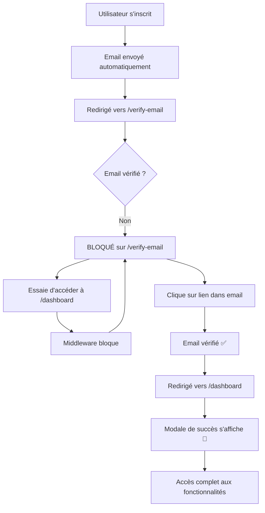

# 🔒 Système de Blocage Complet - Vérification d'Email

> **Dernière mise à jour** : 11 octobre 2025
> 
> **Objectif** : Bloquer **complètement** l'utilisateur non vérifié sur la page de vérification et afficher une modale de succès élégante après vérification.

---

## 🎯 Concept Principal

### ❌ **Avant (Ancien Système)**
- L'utilisateur pouvait accéder au dashboard, profil, etc. sans vérification
- Pas de message clair sur les restrictions
- Pas de célébration après vérification

### ✅ **Après (Nouveau Système)**
- **Blocage total** : L'utilisateur reste bloqué sur `/verify-email`
- **Message d'avertissement fort** : Alert rouge avec icône cadenas
- **Modale de succès animée** : Célébration après vérification avec liste des fonctionnalités débloquées

---

## 🚀 Workflow Complet



---

## 🔒 Routes Bloquées (Middleware `verified`)

### **Routes 100% bloquées sans email vérifié :**

#### 1️⃣ **Dashboard**
- `/dashboard` (page principale)
- `/dashboard/analytics` (statistiques)
- `/dashboard/notifications` (notifications)

#### 2️⃣ **Profil**
- `/profile` (voir profil)
- `/profile/edit` (modifier profil)
- `/profile/stats` (statistiques)
- `/profile/security` (sécurité)
- `/profile/notifications` (paramètres)

#### 3️⃣ **Items (Articles)**
- `/items/create` (créer article)
- `/items/{item}/edit` (modifier article)
- `/my-items` (mes articles)
- `/items/personalization` (personnalisation)

#### 4️⃣ **Commandes**
- `/orders` (liste commandes)
- `/orders/create` (passer commande)
- `/my-sales` (mes ventes)

#### 5️⃣ **Messagerie**
- `/messages` (liste messages)
- `/messages/create` (nouveau message)
- `/messages/{user}` (conversation)

#### 6️⃣ **Paramètres**
- `/settings` (paramètres application)

#### 7️⃣ **Wallet & Transactions**
- `/wallet` (portefeuille)
- `/wallet/add-funds` (recharger)
- `/wallet/withdraw-funds` (retirer)

---

## ✅ Routes Accessibles (Sans vérification)

### **Routes publiques ou en lecture seule :**

1. **Page d'accueil** : `/` (Welcome)
2. **Authentification** : `/login`, `/register`, `/logout`
3. **Vérification email** : `/verify-email`, `/verify-email/{id}/{hash}`
4. **Items (lecture seule)** : `/items` (liste), `/items/{item}` (voir détail)
5. **Thème** : `/theme/toggle`, `/theme/set`, `/theme/get`
6. **Catégories (lecture)** : `/categories`, `/categories/{category}`

---

## 🛡️ Middleware `EnsureEmailIsVerified`

**Fichier** : `app/Http/Middleware/EnsureEmailIsVerified.php`

### **Logique :**

```php
public function handle(Request $request, Closure $next): Response
{
    $user = Auth::user();

    // Si l'utilisateur est connecté et son email n'est pas vérifié
    if ($user && is_null($user->email_verified_at)) {
        // Ne pas rediriger si on est déjà sur les routes de vérification
        if (!$request->routeIs('verification.*') && !$request->routeIs('logout')) {
            return redirect()->route('verification.notice')
                ->with('warning', 'Veuillez vérifier votre email avant d\'accéder à cette fonctionnalité.');
        }
    }

    return $next($request);
}
```

### **Enregistrement dans `bootstrap/app.php` :**

```php
'verified' => \App\Http\Middleware\EnsureEmailIsVerified::class,
```

---

## 🎨 Page de Vérification (`verify-email.blade.php`)

### **Améliorations apportées :**

#### **1. Alert d'Avertissement Fort**
```html
<div class="alert alert-danger border-danger shadow-sm mb-4">
    <h5 class="alert-heading fw-bold">
        <i class="fas fa-exclamation-triangle me-1"></i>
        Accès Restreint
    </h5>
    <p class="mb-2 fw-semibold">
        Votre compte est actuellement <span class="text-danger">suspendu</span> 
        en attente de vérification d'email.
    </p>
    <p class="mb-0 small">
        <i class="fas fa-ban me-1"></i>
        Vous ne pouvez pas accéder aux fonctionnalités tant que votre email n'est pas vérifié.
    </p>
</div>
```

**Éléments visuels :**
- 🔒 Icône cadenas (fa-lock)
- ⚠️ Icône avertissement (fa-exclamation-triangle)
- 🚫 Icône interdiction (fa-ban)
- Badge rouge "SUSPENDU"
- Alert rouge Bootstrap

#### **2. Instructions Claires**
- Étape 1 : Ouvrez votre boîte email
- Étape 2 : Cliquez sur le lien de vérification
- Étape 3 : Revenez sur VintApp

#### **3. Bouton Renvoyer Email**
- Rate limiting : 6 tentatives par minute
- Message de succès après renvoi

---

## 🎉 Modale de Succès (Dashboard)

**Fichier** : `resources/views/dashboard/index.blade.php`

### **Déclenchement :**
```php
// Dans EmailVerificationController::verify()
return redirect()->route('dashboard')->with('email_verified', true);

// Dans la vue dashboard
@if(session('email_verified'))
    <!-- Modale s'affiche -->
@endif
```

### **Design de la Modale :**

#### **Header Vert Dégradé**
- Background : `linear-gradient(135deg, #10b981 0%, #34d399 100%)`
- Icône check animée (bounce)
- Titre : "🎉 Email Vérifié avec Succès !"

#### **Contenu**
```
Bienvenue sur VintApp !

Votre compte est maintenant [BADGE: ACTIF]

Fonctionnalités débloquées :
✅ Créer et vendre des articles
✅ Passer des commandes
✅ Envoyer des messages
✅ Gérer votre profil

🎊 🎉 ✨ 🎊
```

#### **Footer**
- Bouton vert : "Commencer à Explorer"
- Fermeture possible par :
  - Clic sur le bouton
  - Clic en dehors de la modale
  - Touche Échap

### **Animations :**

```css
/* Bounce pour l'icône */
@keyframes bounce {
    0%, 100% {
        transform: translateY(0);
    }
    50% {
        transform: translateY(-10px);
    }
}

/* Slide in pour la modale */
@keyframes slideInDown {
    from {
        opacity: 0;
        transform: translateY(-50px);
    }
    to {
        opacity: 1;
        transform: translateY(0);
    }
}
```

---

## 🧪 Scénarios de Test

### **Test 1 : Blocage Complet**

```bash
1. S'inscrire sur /register
2. ✅ Vérifier : Redirigé vers /verify-email
3. ✅ Vérifier : Alert rouge "Accès Restreint" visible
4. Essayer d'aller sur /dashboard
5. ✅ Vérifier : Bloqué et redirigé vers /verify-email
6. Essayer d'aller sur /profile
7. ✅ Vérifier : Bloqué et redirigé vers /verify-email
8. Essayer d'aller sur /items/create
9. ✅ Vérifier : Bloqué et redirigé vers /verify-email
```

### **Test 2 : Vérification et Modale**

```bash
1. Après inscription, rester sur /verify-email
2. Ouvrir l'email reçu (Mailtrap ou Gmail)
3. Cliquer sur le lien de vérification
4. ✅ Vérifier : Redirigé vers /dashboard
5. ✅ Vérifier : Modale verte s'affiche automatiquement
6. ✅ Vérifier : Icône check animée (bounce)
7. ✅ Vérifier : Liste des fonctionnalités débloquées visible
8. Cliquer sur "Commencer à Explorer"
9. ✅ Vérifier : Modale se ferme
10. ✅ Vérifier : Dashboard complet accessible
```

### **Test 3 : Empêcher le Retour Arrière**

```bash
1. Après vérification d'email
2. Essayer d'aller manuellement sur /verify-email
3. ✅ Vérifier : Automatiquement redirigé vers /dashboard
4. ✅ Vérifier : Pas de modale (session expirée)
```

### **Test 4 : Renvoyer Email**

```bash
1. Sur /verify-email
2. Cliquer sur "Renvoyer l'email de vérification"
3. ✅ Vérifier : Message de succès affiché
4. ✅ Vérifier : Nouvel email reçu dans la boîte
5. Cliquer 7 fois rapidement sur le bouton
6. ✅ Vérifier : Rate limiting bloque (6 max/minute)
```

### **Test 5 : Routes Accessibles Sans Vérification**

```bash
1. Après inscription (sans vérifier)
2. Aller sur /items
3. ✅ Vérifier : Page accessible (lecture seule)
4. Aller sur /categories
5. ✅ Vérifier : Page accessible
6. Essayer de changer le thème
7. ✅ Vérifier : Thème change correctement
8. Se déconnecter
9. ✅ Vérifier : Déconnexion réussie
```

---

## 📋 Fichiers Modifiés

### **1. Routes (`routes/web.php`)**
**Modifications :**
- ✅ Regroupé TOUTES les routes protégées dans `Route::middleware(['auth', 'verified'])`
- ✅ Supprimé les routes de thème en double
- ✅ Ajouté commentaires explicites sur les routes bloquées

**Lignes 28-76** : Groupe `auth + verified` avec toutes les routes sensibles

### **2. Middleware (`app/Http/Middleware/EnsureEmailIsVerified.php`)**
**État :** ✅ Déjà créé et fonctionnel
**Enregistré dans :** `bootstrap/app.php`

### **3. Controller (`app/Http/Controllers/Auth/EmailVerificationController.php`)**
**Modifications :**
- ✅ Changé le message de succès en session `email_verified`
- ✅ Permet d'afficher la modale au lieu d'un simple message flash

**Méthode `verify()` :**
```php
return redirect()->route('dashboard')->with('email_verified', true);
```

### **4. Vue Vérification (`resources/views/auth/verify-email.blade.php`)**
**Modifications :**
- ✅ Ajout de l'alert danger "Accès Restreint" en haut
- ✅ Icônes visuelles (cadenas, avertissement, interdiction)
- ✅ Message fort : "Compte SUSPENDU"

### **5. Vue Dashboard (`resources/views/dashboard/index.blade.php`)**
**Modifications :**
- ✅ Ajout de la modale de succès complète
- ✅ Animations CSS (bounce, slideInDown)
- ✅ JavaScript pour fermeture (clic outside, Échap)

---

## 🔐 Sécurité

### **1. Rate Limiting**
- Route `verification.send` : 6 tentatives/minute
- Route `verification.verify` : 6 tentatives/minute
- Empêche le spam de demandes

### **2. URLs Signées**
- Lien de vérification signé avec hash
- Expire automatiquement après un délai
- Impossible de forger un lien valide

### **3. Middleware Vérifié**
- Vérifie `email_verified_at IS NULL`
- Autorise uniquement `verification.*` et `logout`
- Bloque toutes les autres routes

### **4. Session Flash**
- `email_verified` n'est présent qu'une seule fois
- Disparaît après affichage de la modale
- Pas de réaffichage après rechargement

---

## 🎯 Messages Utilisateur

### **Page de Vérification**

| Situation | Message | Style |
|-----------|---------|-------|
| Non vérifié | "Accès Restreint - Compte SUSPENDU" | Alert danger |
| Email renvoyé | "Un nouvel email a été envoyé !" | Alert success |
| Tentative d'accès | "Veuillez vérifier votre email..." | Flash warning |

### **Dashboard**

| Situation | Message | Style |
|-----------|---------|-------|
| Email vérifié | Modale : "Email Vérifié avec Succès !" | Modale verte animée |
| Déjà vérifié | "Votre email est déjà vérifié." | Flash info |

---

## 🛠️ Maintenance

### **Vider les Caches**
```bash
php artisan config:clear
php artisan cache:clear
php artisan route:clear
php artisan view:clear
```

### **Tester l'Envoi d'Email**
```bash
# Commande créée
php artisan email:test-verification

# Avec email spécifique
php artisan email:test-verification user@example.com
```

### **Vérifier la Configuration**
```bash
php artisan route:list | findstr verified
php artisan config:show mail
```

---

## ✅ Checklist de Déploiement

- [x] Routes protégées par middleware `verified`
- [x] Middleware enregistré dans `bootstrap/app.php`
- [x] Alert d'avertissement sur `verify-email.blade.php`
- [x] Modale de succès dans `dashboard/index.blade.php`
- [x] Controller retourne `email_verified` session
- [x] Listener `SendEmailVerificationNotification` créé
- [x] Caches vidés
- [ ] Test complet du workflow
- [ ] Vérifier que les emails sont envoyés (Mailtrap/Gmail)
- [ ] Tester sur mobile (responsive)

---

## 📚 Documentation Complémentaire

- **Configuration Email** : `EMAIL_CONFIG_GUIDE.md`
- **Workflow Vérification** : `EMAIL_VERIFICATION_WORKFLOW.md`
- **Routes Migration** : `ROUTES_MIGRATION_CHECKLIST.md`

---

**✅ Le système de blocage complet est maintenant opérationnel !**

**💡 L'utilisateur est 100% bloqué sur /verify-email jusqu'à la vérification, puis une belle modale de célébration s'affiche ! 🎉**
