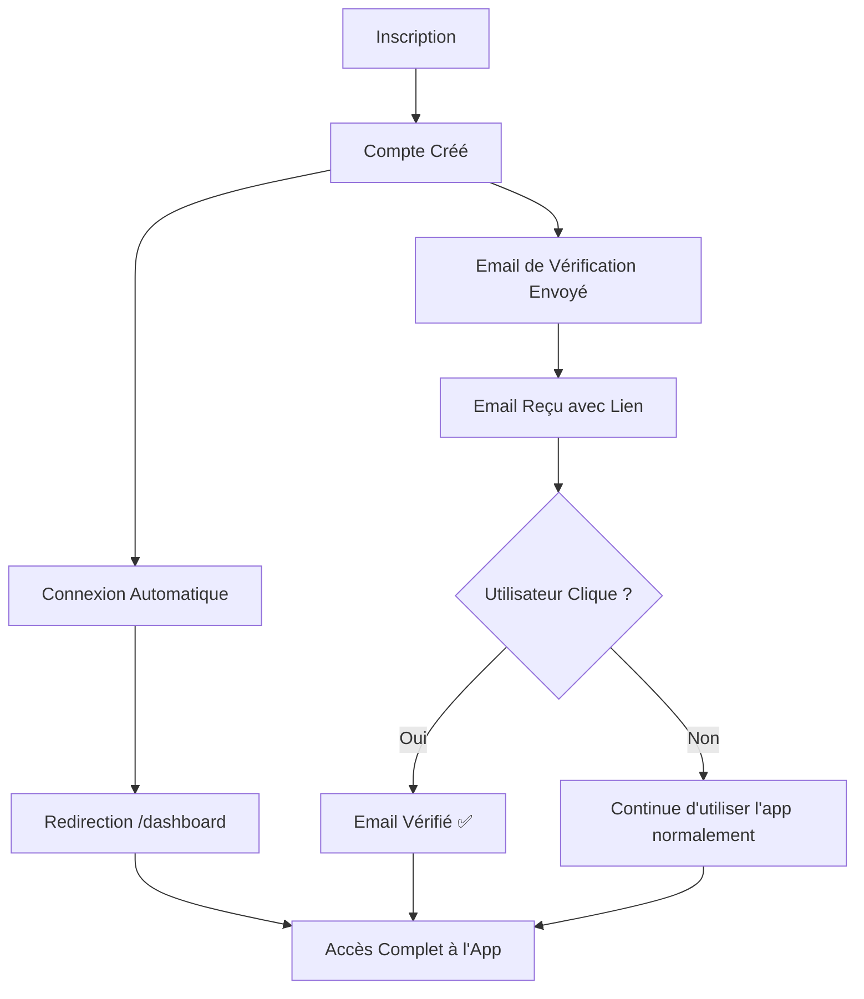

# 📧 Configuration de la Vérification Email - VintApp

## 📋 Résumé

La vérification d'email a été configurée pour **ne pas bloquer l'accès à l'application** après l'inscription ou la connexion. Les utilisateurs reçoivent un email de vérification à l'inscription, mais peuvent utiliser toutes les fonctionnalités de l'app **sans attendre** de vérifier leur email.

---

## 🎯 Comportement Actuel

### ✅ À l'Inscription
1. Utilisateur remplit le formulaire d'inscription
2. Compte créé dans la base de données
3. **Email de vérification envoyé automatiquement**
4. Utilisateur connecté automatiquement
5. Redirection vers `/dashboard`
6. **Accès complet à toutes les fonctionnalités**

### ✅ À la Connexion
1. Utilisateur entre ses identifiants
2. Vérification des credentials (email + mot de passe)
3. Connexion réussie
4. **Pas de vérification du statut email_verified_at**
5. Accès direct au dashboard et toutes les fonctionnalités

### 📨 Email de Vérification
- Envoyé automatiquement via l'événement `Registered`
- Interface `MustVerifyEmail` maintenue sur le modèle `User`
- Lien de vérification fonctionnel si l'utilisateur clique dessus
- **Optionnel** : L'utilisateur peut l'ignorer et utiliser l'app normalement

---

## 🔧 Modifications Techniques

### Fichier: `routes/web.php`

**AVANT (Bloquant):**
```php
Route::get('/dashboard', [DashboardController::class, 'index'])
    ->middleware(['auth', 'verified'])  // ❌ Bloquait l'accès
    ->name('dashboard');

Route::middleware(['auth', 'verified'])->group(function () {
    // Toutes les routes bloquées sans email vérifié
});
```

**APRÈS (Non bloquant):**
```php
Route::get('/dashboard', [DashboardController::class, 'index'])
    ->middleware(['auth'])  // ✅ Seulement authentification
    ->name('dashboard');

Route::middleware(['auth'])->group(function () {
    // Toutes les routes accessibles après connexion
});
```

### Routes Modifiées

| Groupe de Routes | Middleware AVANT | Middleware APRÈS | État |
|------------------|------------------|------------------|------|
| Dashboard | `['auth', 'verified']` | `['auth']` | ✅ Débloqué |
| Items CRUD | `['auth', 'verified']` | `['auth']` | ✅ Débloqué |
| Profil | `['auth', 'verified']` | `['auth']` | ✅ Débloqué |
| Commandes | `['auth', 'verified']` | `['auth']` | ✅ Débloqué |
| Messages | `['auth', 'verified']` | `['auth']` | ✅ Débloqué |
| Settings | `['auth', 'verified']` | `['auth']` | ✅ Débloqué |
| Notifications | `['auth', 'verified']` | `['auth']` | ✅ Débloqué |

---

## 📊 Flux Utilisateur



---

## 🔐 Sécurité Maintenue

### ✅ Protections Actives
1. **Authentification requise** : Middleware `auth` sur toutes les routes sensibles
2. **Hashage des mots de passe** : `bcrypt` avec Laravel
3. **CSRF Protection** : Tokens CSRF sur tous les formulaires
4. **Validation des données** : Rules strictes sur inputs
5. **Authorization** : Policies sur les ressources (items, orders, etc.)

### 📧 Email de Vérification (Optionnel mais Disponible)
- L'interface `MustVerifyEmail` est conservée
- Les routes de vérification sont fonctionnelles
- Si besoin, le middleware `verified` peut être réactivé facilement

---

## 🎨 Expérience Utilisateur

### Avantages
✅ **Inscription fluide** : Pas de friction après l'inscription  
✅ **Accès immédiat** : Utilisateurs peuvent explorer l'app tout de suite  
✅ **Moins d'abandon** : Pas de blocage frustrant  
✅ **Email de sécurité** : Vérification disponible si nécessaire  

### Inconvénients Potentiels
⚠️ **Spam potentiel** : Inscriptions avec faux emails  
⚠️ **Récupération de compte** : Difficile si email invalide  

**Solution** : Afficher un banner de rappel sur le dashboard pour inciter à vérifier l'email.

---

## 💡 Recommandations

### Option 1 : Banner de Rappel (Recommandé)
Ajouter un banner discret sur le dashboard pour les utilisateurs non vérifiés :

```blade
@if(!Auth::user()->hasVerifiedEmail())
    <div class="alert alert-warning alert-dismissible fade show" role="alert">
        <i class="fas fa-envelope me-2"></i>
        <strong>Email non vérifié</strong> 
        Vérifiez votre email pour sécuriser votre compte.
        <a href="{{ route('verification.notice') }}" class="alert-link">Renvoyer l'email</a>
        <button type="button" class="btn-close" data-bs-dismiss="alert"></button>
    </div>
@endif
```

### Option 2 : Récompense pour Vérification
Inciter les utilisateurs à vérifier leur email avec des avantages :
- Badge "Compte Vérifié" ✅
- Accès à des fonctionnalités premium
- Augmentation de la limite de vente
- Priorité dans les recherches

### Option 3 : Vérification Obligatoire après X jours
Donner une période de grâce (ex: 7 jours) avant de rendre la vérification obligatoire :

```php
// Middleware personnalisé
if (!$user->hasVerifiedEmail() && $user->created_at->diffInDays(now()) > 7) {
    return redirect()->route('verification.notice');
}
```

---

## 🧪 Tests

### Test 1 : Inscription Sans Vérification
```bash
1. Accéder à /register
2. Remplir le formulaire avec un email valide
3. Soumettre
4. Vérifier redirection vers /dashboard ✅
5. Vérifier accès à /items/create ✅
6. Vérifier accès à /profile ✅
7. Vérifier accès à /orders ✅
```

### Test 2 : Connexion Sans Vérification
```bash
1. S'inscrire avec un nouvel email
2. Ne pas vérifier l'email
3. Se déconnecter
4. Se reconnecter avec les mêmes identifiants
5. Vérifier redirection vers /dashboard ✅
6. Vérifier accès complet ✅
```

### Test 3 : Vérification Email (Optionnelle)
```bash
1. S'inscrire
2. Ouvrir l'email de vérification
3. Cliquer sur le lien
4. Vérifier message "Email vérifié ✅"
5. Vérifier colonne email_verified_at remplie en BDD
```

---

## 🔄 Réactiver la Vérification (Si Nécessaire)

Si vous souhaitez **réactiver le blocage** pour certaines routes sensibles :

```php
// routes/web.php

// Routes nécessitant la vérification
Route::middleware(['auth', 'verified'])->group(function () {
    // Paiements
    Route::post('/payments/simulate', [PaymentController::class, 'simulatePayment']);
    
    // Retraits
    Route::post('/wallet/withdraw', [WalletController::class, 'withdraw']);
    
    // Actions sensibles
    Route::delete('/account', [ProfileController::class, 'destroy']);
});
```

---

## 📝 Modèle User

Le modèle `User` conserve l'interface `MustVerifyEmail` :

```php
<?php

namespace App\Models;

use Illuminate\Contracts\Auth\MustVerifyEmail;
use Illuminate\Foundation\Auth\User as Authenticatable;

class User extends Authenticatable implements MustVerifyEmail
{
    // Interface maintenue pour compatibilité
    // Permet d'utiliser hasVerifiedEmail() et sendEmailVerificationNotification()
}
```

**Méthodes disponibles :**
- `$user->hasVerifiedEmail()` : Vérifie si l'email est vérifié
- `$user->sendEmailVerificationNotification()` : Renvoie l'email de vérification
- `$user->markEmailAsVerified()` : Marque l'email comme vérifié

---

## 🎯 Résumé des Changements

| Aspect | Avant | Après |
|--------|-------|-------|
| **Inscription** | Email vérifié obligatoire | Email optionnel |
| **Connexion** | Vérifie email_verified_at | Ignore email_verified_at |
| **Dashboard** | Bloqué si non vérifié | Accessible toujours |
| **Routes CRUD** | Bloquées si non vérifié | Accessibles toujours |
| **Email envoyé** | Oui | Oui (conservé) |
| **Lien fonctionnel** | Oui | Oui (conservé) |

---

## 🚀 Prochaines Étapes

1. ✅ **Tester l'inscription** sans vérifier l'email
2. ✅ **Vérifier l'accès** au dashboard et aux fonctionnalités
3. 🔄 **Ajouter un banner de rappel** (optionnel)
4. 🔄 **Implémenter des récompenses** pour inciter la vérification
5. 🔄 **Monitorer les taux de vérification** avec des metrics

---

## 📞 Support

Pour toute question sur la vérification d'email :
- 📧 Email : support@vintapp.com
- 💬 Documentation Laravel : https://laravel.com/docs/verification
- 📚 Guide complet : `EMAIL_VERIFICATION_CONFIG.md`

---

**Créé le :** 11 octobre 2025  
**Version :** 2.0  
**Statut :** ✅ Actif (Non bloquant)  
**Auteur :** VintApp Team
