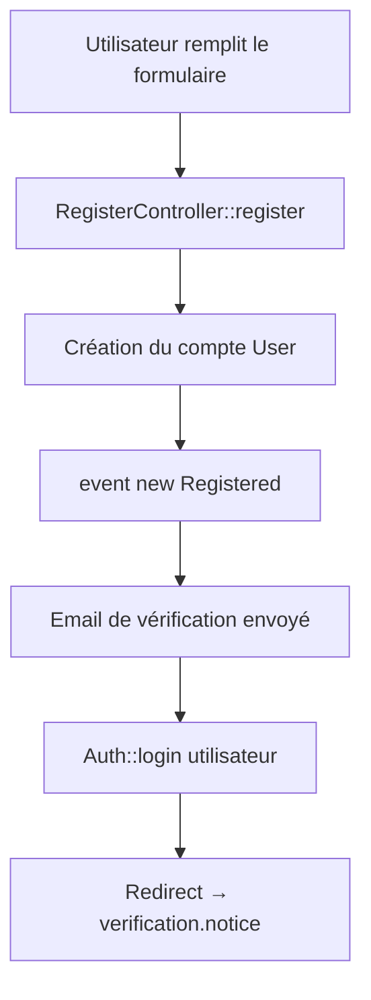

# 📧 Workflow de Vérification d'Email

> **Dernière mise à jour** : $(date)
> 
> **Objectif** : Vérifier l'email de l'utilisateur **uniquement à l'inscription**, pas à la connexion. Bloquer l'accès aux fonctionnalités tant que l'email n'est pas vérifié.

---

## 🎯 Problème Résolu

### ❌ Ancien système (MAUVAIS)
- L'utilisateur s'inscrivait → Accédait au dashboard immédiatement
- À la **connexion suivante** → Demande de vérification d'email (UX frustrante)
- L'utilisateur pouvait utiliser l'app sans email vérifié

### ✅ Nouveau système (BON)
- L'utilisateur s'inscrit → **Email envoyé automatiquement**
- Redirigé vers une **page de notification claire** avec instructions
- **Bloqué de toutes les fonctionnalités** tant que l'email n'est pas vérifié
- À la connexion → **Aucune vérification**, connexion directe

---

## 🚀 Workflow Complet

### 1️⃣ Inscription (Register)



**Fichier** : `app/Http/Controllers/Auth/RegisterController.php`

```php
event(new Registered($user)); // 📧 Email envoyé automatiquement
Auth::login($user);            // 🔓 Connexion automatique
return redirect()->route('verification.notice')
    ->with('success', 'Compte créé avec succès ! Veuillez vérifier votre email...');
```

---

### 2️⃣ Page de Notification (verification.notice)

**Route** : `/verify-email`  
**View** : `resources/views/auth/verify-email.blade.php`  
**Controller** : `EmailVerificationController::notice()`

**Affiche** :
- ✉️ Email de l'utilisateur
- 📋 Instructions en 3 étapes
- 🔄 Bouton "Renvoyer l'email"
- 🚪 Bouton "Déconnexion"
- ⚠️ Rappel de vérifier les spams

**Vérifications** :
- Si l'email est déjà vérifié → Redirect dashboard
- Sinon → Affiche la page

```php
public function notice()
{
    if (Auth::user()->hasVerifiedEmail()) {
        return redirect()->route('dashboard');
    }
    return view('auth.verify-email');
}
```

---

### 3️⃣ Clic sur le Lien de Vérification

**Route** : `/verify-email/{id}/{hash}`  
**Middleware** : `signed`, `throttle:6,1`  
**Controller** : `EmailVerificationController::verify()`

**Workflow** :
1. Vérifie que le lien est **signé et valide**
2. Vérifie que l'email n'est **pas déjà vérifié**
3. Marque l'email comme vérifié (`email_verified_at = now()`)
4. Déclenche l'événement `Verified`
5. Redirige vers le dashboard avec message de succès

```php
public function verify(EmailVerificationRequest $request)
{
    if ($request->user()->hasVerifiedEmail()) {
        return redirect()->route('dashboard')->with('info', 'Votre email est déjà vérifié.');
    }

    if ($request->user()->markEmailAsVerified()) {
        event(new Verified($request->user()));
    }

    return redirect()->route('dashboard')
        ->with('success', 'Votre email a été vérifié avec succès !');
}
```

---

### 4️⃣ Renvoyer l'Email de Vérification

**Route** : `/email/verification-notification` (POST)  
**Middleware** : `throttle:6,1` (6 tentatives par minute)  
**Controller** : `EmailVerificationController::resend()`

**Workflow** :
1. Vérifie que l'email n'est **pas déjà vérifié**
2. Envoie une nouvelle notification de vérification
3. Retourne à la page de notification avec message de succès

```php
public function resend(Request $request)
{
    if ($request->user()->hasVerifiedEmail()) {
        return redirect()->route('dashboard');
    }

    $request->user()->sendEmailVerificationNotification();

    return back()->with('success', 'Un nouvel email de vérification a été envoyé !');
}
```

---

### 5️⃣ Middleware de Blocage

**Fichier** : `app/Http/Middleware/EnsureEmailIsVerified.php`  
**Alias** : `'verified'`  
**Enregistré dans** : `bootstrap/app.php`

**Logique** :
- Si l'utilisateur est connecté ET son email n'est pas vérifié
- ET qu'il tente d'accéder à une route protégée (pas `verification.*` ou `logout`)
- → Redirige vers `verification.notice` avec message d'avertissement

```php
public function handle(Request $request, Closure $next): Response
{
    $user = Auth::user();

    if ($user && is_null($user->email_verified_at)) {
        if (!$request->routeIs('verification.*') && !$request->routeIs('logout')) {
            return redirect()->route('verification.notice')
                ->with('warning', 'Veuillez vérifier votre email avant d\'accéder à cette fonctionnalité.');
        }
    }

    return $next($request);
}
```

---

### 6️⃣ Application du Middleware

Dans `routes/web.php`, le middleware `'verified'` est appliqué sur :

#### ✅ Routes qui NÉCESSITENT une vérification d'email :

1. **Dashboard** (principal)
```php
Route::get('/dashboard', ...)->middleware(['auth', 'verified']);
```

2. **Créer/Vendre des items**
```php
Route::middleware(['auth', 'verified'])->group(function () {
    Route::get('/items/create', ...);
    Route::post('/items', ...);
    Route::get('/my-items', ...);
    // ... etc.
});
```

3. **Commandes (Orders)**
```php
Route::middleware(['auth', 'verified'])->group(function () {
    Route::get('/orders', ...);
    Route::post('/orders', ...);
    // ... etc.
});
```

4. **Messagerie**
```php
Route::middleware(['auth', 'verified'])->group(function () {
    Route::get('/messages', ...);
    Route::post('/messages', ...);
    // ... etc.
});
```

#### ⚪ Routes ACCESSIBLES sans vérification :

1. **Connexion/Déconnexion** : `login`, `logout`
2. **Routes de vérification** : `verification.*`
3. **Voir les items** (lecture seule) : `items.show`, `items.index`
4. **Profil** (consultation) : `profile.index`, `profile.edit`
5. **Thème** : `theme.toggle`, `theme.set`

---

## 📋 Routes de Vérification

| Route | Méthode | Nom | Middleware | Action |
|-------|---------|-----|------------|--------|
| `/verify-email` | GET | `verification.notice` | `auth` | Affiche page de notification |
| `/verify-email/{id}/{hash}` | GET | `verification.verify` | `signed`, `throttle:6,1` | Vérifie l'email |
| `/email/verification-notification` | POST | `verification.send` | `throttle:6,1` | Renvoie l'email |

---

## 🔒 Sécurité

### 1. **Liens signés**
- Utilise des URLs signées avec hash pour éviter les manipulations
- Expire automatiquement après un certain temps
- Laravel génère automatiquement ces liens

### 2. **Rate Limiting**
- Maximum 6 tentatives par minute pour vérifier l'email
- Maximum 6 renvois d'email par minute
- Protège contre les attaques par force brute

### 3. **Middleware Auth**
- Toutes les routes de vérification nécessitent une authentification
- Empêche les accès non autorisés

---

## 🧪 Comment Tester

### Test 1 : Inscription Complète
```bash
1. Aller sur /register
2. Remplir le formulaire d'inscription
3. Cliquer sur "S'inscrire"
4. ✅ Vérifier : Redirigé vers /verify-email
5. ✅ Vérifier : Email reçu dans Mailtrap
6. Cliquer sur le lien dans l'email
7. ✅ Vérifier : Redirigé vers /dashboard
8. ✅ Vérifier : Message "Votre email a été vérifié avec succès !"
```

### Test 2 : Accès Bloqué Sans Vérification
```bash
1. Après inscription (sans vérifier l'email)
2. Essayer d'accéder à /items/create
3. ✅ Vérifier : Redirigé vers /verify-email
4. ✅ Vérifier : Message d'avertissement affiché
```

### Test 3 : Renvoyer l'Email
```bash
1. Sur la page /verify-email
2. Cliquer sur "Renvoyer l'email de vérification"
3. ✅ Vérifier : Message "Un nouvel email a été envoyé !"
4. ✅ Vérifier : Nouvel email reçu dans Mailtrap
```

### Test 4 : Connexion Sans Vérification
```bash
1. S'inscrire sans vérifier l'email
2. Se déconnecter
3. Se reconnecter avec les mêmes identifiants
4. ✅ Vérifier : Connexion réussie IMMÉDIATEMENT
5. ✅ Vérifier : Redirigé vers /verify-email (pas de blocage à la connexion)
```

### Test 5 : Email Déjà Vérifié
```bash
1. Vérifier l'email (clic sur le lien)
2. Cliquer à nouveau sur le même lien
3. ✅ Vérifier : Redirigé vers /dashboard
4. ✅ Vérifier : Message "Votre email est déjà vérifié."
```

---

## 🗂️ Fichiers Modifiés

### 1. **Controllers**
- `app/Http/Controllers/Auth/RegisterController.php` (Modifié)
  - Ajout de `event(new Registered($user))`
  - Redirection vers `verification.notice`
- `app/Http/Controllers/Auth/EmailVerificationController.php` (Créé)
  - `notice()`, `verify()`, `resend()`

### 2. **Middleware**
- `app/Http/Middleware/EnsureEmailIsVerified.php` (Créé)
  - Bloque les utilisateurs sans email vérifié

### 3. **Configuration**
- `bootstrap/app.php` (Modifié)
  - Enregistrement du middleware `'verified'`

### 4. **Routes**
- `routes/auth.php` (Modifié)
  - Nouvelles routes de vérification

### 5. **Views**
- `resources/views/auth/verify-email.blade.php` (Existait déjà)
  - Page de notification avec design Tailwind

---

## 📊 Base de Données

### Table `users`
```sql
email_verified_at TIMESTAMP NULL
```

- `NULL` → Email non vérifié
- `TIMESTAMP` → Email vérifié à cette date/heure

**Vérification dans le code** :
```php
// Vérifier si l'email est vérifié
if ($user->hasVerifiedEmail()) { ... }

// Marquer comme vérifié
$user->markEmailAsVerified();

// Vérifier la colonne directement
if (is_null($user->email_verified_at)) { ... }
```

---

## 🎨 UX/UI

### Page de Notification (`verify-email.blade.php`)

**Design** :
- 🎨 Design Tailwind CSS moderne
- 📱 Responsive (mobile, tablet, desktop)
- 🎯 Message clair en français
- ✅ Instructions en 3 étapes
- 🔄 Bouton de renvoi d'email
- 🚪 Bouton de déconnexion

**Messages Flash** :
- `success` : Vert, email envoyé/vérifié
- `warning` : Orange, accès bloqué
- `info` : Bleu, email déjà vérifié

---

## 🔧 Maintenance

### Vider les caches après modification
```bash
php artisan config:clear
php artisan cache:clear
php artisan route:clear
php artisan view:clear
```

### Régénérer les caches en production
```bash
php artisan config:cache
php artisan route:cache
php artisan view:cache
```

---

## ✅ Checklist de Déploiement

- [x] Vérifier que `User` implémente `MustVerifyEmail`
- [x] Vérifier que les routes de vérification existent
- [x] Vérifier que le middleware `'verified'` est enregistré
- [x] Vérifier que le middleware est appliqué aux bonnes routes
- [x] Vider tous les caches Laravel
- [ ] Tester le workflow complet
- [ ] Vérifier que les emails sont envoyés (Mailtrap/production)
- [ ] Tester sur mobile (responsive)
- [ ] Vérifier les traductions françaises

---

## 🆘 Dépannage

### Problème : Email non envoyé
**Solution** : Vérifier la configuration mail dans `.env`
```env
MAIL_MAILER=smtp
MAIL_HOST=sandbox.smtp.mailtrap.io
MAIL_PORT=2525
MAIL_USERNAME=your_username
MAIL_PASSWORD=your_password
```

### Problème : Middleware ne bloque pas
**Solution** : Vérifier que le middleware est bien appliqué dans `web.php`
```php
Route::middleware(['auth', 'verified'])->group(function () { ... });
```

### Problème : Boucle de redirection
**Solution** : Vérifier que les routes `verification.*` et `logout` ne sont **pas** dans un groupe `verified`

### Problème : Lien de vérification expiré
**Solution** : Renvoyer l'email via le bouton "Renvoyer"

---

## 📚 Références

- [Documentation Laravel - Email Verification](https://laravel.com/docs/11.x/verification)
- [MustVerifyEmail Contract](https://laravel.com/api/11.x/Illuminate/Contracts/Auth/MustVerifyEmail.html)
- [Signed URLs](https://laravel.com/docs/11.x/urls#signed-urls)
- [Rate Limiting](https://laravel.com/docs/11.x/routing#rate-limiting)

---

**✅ Système opérationnel et prêt pour les tests !**
