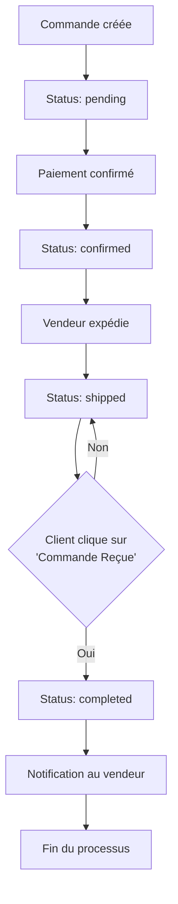

# 📦 Système de Confirmation de Livraison

## Vue d'ensemble

Le système de confirmation de livraison permet aux clients de confirmer qu'ils ont bien reçu leur commande. Une fois confirmée, le vendeur est notifié et la commande passe automatiquement au statut "complété".

---

## 🎯 Fonctionnalités

### Pour le Client (Acheteur)

1. **Bouton "Commande Reçue"** visible quand :
   - La commande est expédiée (`status = 'shipped'`)
   - OU la commande est livrée (`status = 'delivered'`)
   - ET la confirmation n'a pas encore été faite

2. **Processus de confirmation** :
   - Clic sur le bouton "Commande Reçue"
   - Possibilité d'ajouter un commentaire optionnel
   - Confirmation immédiate
   - Notification envoyée au vendeur

3. **Affichage après confirmation** :
   - Badge vert avec date de confirmation
   - Commentaire du client (si fourni)
   - Statut de la commande passe à "Complété"

### Pour le Vendeur

1. **Notification automatique** quand le client confirme la réception
2. **Traçabilité** : Date et heure exactes de la confirmation
3. **Feedback client** : Commentaire optionnel du client visible

---

## 🗄️ Structure de la Base de Données

### Migration : `add_confirmed_by_buyer_at_to_orders_table`

```php
Schema::table('orders', function (Blueprint $table) {
    $table->timestamp('confirmed_by_buyer_at')->nullable()->after('delivered_at');
    $table->text('buyer_confirmation_note')->nullable()->after('confirmed_by_buyer_at');
});
```

**Nouveaux champs** :
- `confirmed_by_buyer_at` : Date et heure de confirmation par le client
- `buyer_confirmation_note` : Commentaire optionnel du client

---

## 🛣️ Routes

### Route de confirmation

```php
POST /orders/{order}/confirm-delivery
```

**Middleware** : `auth`, `verified`

**Méthode** : `OrderController@confirmDelivery`

---

## 🎮 Contrôleur

### Méthode : `confirmDelivery()`

**Fichier** : `app/Http/Controllers/OrderController.php`

**Logique** :

1. **Vérifications** :
   - ✅ L'utilisateur est bien l'acheteur
   - ✅ La commande est en statut `shipped` ou `delivered`
   - ✅ La commande n'a pas déjà été confirmée

2. **Actions** :
   - 📅 Enregistre la date de confirmation (`confirmed_by_buyer_at`)
   - 📝 Enregistre le commentaire optionnel (`buyer_confirmation_note`)
   - 🔄 Change le statut de la commande à `completed`
   - 🔔 Crée une notification pour le vendeur

3. **Réponses** :
   - **Succès** : Message de confirmation + redirection
   - **Erreur** : Message d'erreur approprié

---

## 🖼️ Vues

### 1. Page Liste des Commandes (`orders/index.blade.php`)

**Emplacement du bouton** : Dans chaque carte de commande

```blade
@if(in_array($order->status, ['shipped', 'delivered']) && !$order->confirmed_by_buyer_at)
    <button class="btn btn-success btn-sm" 
            data-order-id="{{ $order->id }}"
            onclick="confirmDelivery(this.dataset.orderId)">
        <i class="fas fa-check-circle me-2"></i>
        Commande Reçue
    </button>
@endif

@if($order->confirmed_by_buyer_at)
    <div class="alert alert-success mb-0 py-2" role="alert">
        <i class="fas fa-check-circle me-1"></i>
        <small>Réception confirmée le {{ $order->confirmed_by_buyer_at->format('d/m/Y') }}</small>
    </div>
@endif
```

### 2. Page Détails de la Commande (`orders/show.blade.php`)

**Emplacement** : Section "Actions rapides"

```blade
@if($order->buyer_id === Auth::id() && in_array($order->status, ['shipped', 'delivered']) && !$order->confirmed_by_buyer_at)
    <button class="btn btn-success" 
            onclick="confirmDelivery()">
        <i class="fas fa-check-circle me-2"></i>
        ✅ Commande Reçue
    </button>
@endif

@if($order->confirmed_by_buyer_at)
    <div class="alert alert-success mb-0" role="alert">
        <i class="fas fa-check-circle me-2"></i>
        <strong>Réception confirmée</strong>
        <br>
        <small>Le {{ $order->confirmed_by_buyer_at->format('d/m/Y à H:i') }}</small>
        @if($order->buyer_confirmation_note)
            <br><small class="text-muted fst-italic">"{{ $order->buyer_confirmation_note }}"</small>
        @endif
    </div>
@endif
```

---

## 💻 JavaScript

### Fonction de Confirmation

```javascript
function confirmDelivery(orderId) {
    // Demander confirmation avec possibilité d'ajouter un commentaire
    const note = prompt('Confirmez-vous avoir reçu votre commande ?\n\nVous pouvez ajouter un commentaire (optionnel) :');
    
    if (note !== null) { // L'utilisateur n'a pas cliqué sur Annuler
        fetch(`/orders/${orderId}/confirm-delivery`, {
            method: 'POST',
            headers: {
                'X-CSRF-TOKEN': document.querySelector('meta[name="csrf-token"]').getAttribute('content'),
                'Accept': 'application/json',
                'Content-Type': 'application/json'
            },
            body: JSON.stringify({
                note: note || ''
            })
        })
        .then(response => response.json())
        .then(data => {
            if (data.success) {
                alert(data.message);
                window.location.reload();
            } else {
                alert(data.error || 'Erreur lors de la confirmation');
            }
        })
        .catch(error => {
            console.error('Error:', error);
            alert('Une erreur est survenue lors de la confirmation');
        });
    }
}
```

---

## 📊 Flux de Travail



---

## 🔔 Notifications

### Type de notification : `order_delivered_confirmed`

**Déclencheur** : Client confirme la réception de la commande

**Destinataire** : Vendeur

**Contenu** :
```php
[
    'type' => 'order_delivered_confirmed',
    'title' => 'Commande confirmée reçue',
    'message' => '[Nom du client] a confirmé avoir reçu la commande #[ID]',
    'action_url' => route('orders.show', $order->id),
    'is_read' => false,
]
```

---

## 🔒 Sécurité

### Vérifications Implémentées

1. **Authentification** : Middleware `auth` requis
2. **Vérification email** : Middleware `verified` requis
3. **Autorisation** : Seul l'acheteur peut confirmer sa propre commande
4. **Statut de commande** : Uniquement pour les commandes expédiées ou livrées
5. **Prévention double confirmation** : Impossible de confirmer deux fois

### Protection CSRF

Toutes les requêtes POST incluent le token CSRF :
```javascript
'X-CSRF-TOKEN': document.querySelector('meta[name="csrf-token"]').getAttribute('content')
```

---

## 🧪 Tests

### Scénarios de Test

#### 1. Confirmation Réussie

**Conditions** :
- ✅ Utilisateur authentifié
- ✅ Utilisateur est l'acheteur
- ✅ Commande au statut `shipped` ou `delivered`
- ✅ Pas encore de confirmation

**Résultat attendu** :
- ✅ `confirmed_by_buyer_at` enregistré
- ✅ `status` = `completed`
- ✅ Notification créée pour le vendeur
- ✅ Message de succès affiché

#### 2. Tentative de Confirmation Non Autorisée

**Conditions** :
- ❌ Utilisateur n'est pas l'acheteur

**Résultat attendu** :
- ❌ Erreur 403 : "Vous n'êtes pas autorisé..."

#### 3. Commande Déjà Confirmée

**Conditions** :
- ❌ `confirmed_by_buyer_at` déjà rempli

**Résultat attendu** :
- ❌ Erreur 400 : "Vous avez déjà confirmé..."

#### 4. Commande Non Expédiée

**Conditions** :
- ❌ `status` = `pending` ou `confirmed`

**Résultat attendu** :
- ❌ Erreur 400 : "Cette commande n'est pas encore expédiée."

---

## 📱 Interface Utilisateur

### États Visuels

#### 1. Commande en attente de confirmation
```
[Bouton vert] Commande Reçue
```

#### 2. Commande confirmée
```
[Alerte verte avec badge]
✅ Réception confirmée
Le 11/10/2025 à 19:30
"Article en parfait état, merci !" (si commentaire)
```

---

## 🚀 Installation

### 1. Exécuter la migration

```bash
php artisan migrate
```

### 2. Vider les caches

```bash
php artisan config:clear
php artisan cache:clear
php artisan route:clear
php artisan view:clear
```

### 3. Tester

1. Créer une commande de test
2. Changer le statut à `shipped` (via panel admin ou directement en BDD)
3. Se connecter en tant qu'acheteur
4. Aller sur la page de la commande
5. Cliquer sur "Commande Reçue"
6. Vérifier la confirmation et la notification vendeur

---

## 📈 Métriques

### Données Disponibles

- Nombre de commandes confirmées
- Délai moyen entre expédition et confirmation
- Taux de confirmation par vendeur
- Commentaires clients pour analyse de satisfaction

### Requêtes Utiles

```php
// Nombre de commandes confirmées aujourd'hui
Order::whereNotNull('confirmed_by_buyer_at')
    ->whereDate('confirmed_by_buyer_at', today())
    ->count();

// Délai moyen de confirmation
Order::whereNotNull('confirmed_by_buyer_at')
    ->whereNotNull('shipped_at')
    ->selectRaw('AVG(TIMESTAMPDIFF(HOUR, shipped_at, confirmed_by_buyer_at)) as avg_hours')
    ->first();

// Commandes avec commentaires positifs
Order::whereNotNull('buyer_confirmation_note')
    ->get();
```

---

## 🔄 Évolutions Futures Possibles

### Phase 2

- [ ] **Système d'évaluation** : Noter le vendeur et le produit
- [ ] **Photos de réception** : Client peut ajouter des photos du produit reçu
- [ ] **Rappels automatiques** : Email de rappel si pas de confirmation après X jours
- [ ] **Dispute** : Système de réclamation si problème avec la commande

### Phase 3

- [ ] **Analyse de sentiment** : Analyse automatique des commentaires
- [ ] **Badges vendeur** : "100% de confirmations", "Livraison rapide", etc.
- [ ] **Historique de livraison** : Graphiques et statistiques pour les vendeurs

---

## 📞 Support

Pour toute question ou problème :

1. **Documentation** : Ce fichier
2. **Code source** :
   - Migration : `database/migrations/2025_10_11_171010_add_confirmed_by_buyer_at_to_orders_table.php`
   - Contrôleur : `app/Http/Controllers/OrderController.php`
   - Modèle : `app/Models/Order.php`
   - Vues : `resources/views/orders/index.blade.php` et `show.blade.php`

---

## ✅ Checklist de Déploiement

- [x] Migration créée
- [x] Modèle Order mis à jour
- [x] Contrôleur OrderController mis à jour
- [x] Route ajoutée
- [x] Vue index.blade.php mise à jour
- [x] Vue show.blade.php mise à jour
- [x] JavaScript ajouté
- [x] Système de notification implémenté
- [ ] Migration exécutée en production
- [ ] Tests effectués
- [ ] Documentation utilisateur créée

---

**Version** : 1.0  
**Date** : 11 octobre 2025  
**Auteur** : Équipe VintApp
