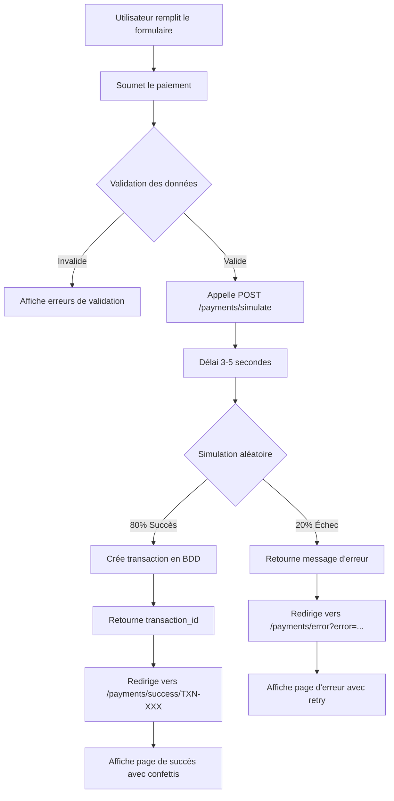

# 💳 Guide de Simulation de Paiement - VintApp

## 📋 Vue d'ensemble

Ce système permet de **simuler les paiements Mobile Money** avant l'intégration des vraies APIs des opérateurs. Il offre une expérience utilisateur complète avec :

- ✅ Simulation de paiement (80% succès, 20% échec)
- 🎉 Page de succès avec animations et confettis
- ❌ Page d'erreur avec diagnostic et retry
- ⏳ Page de statut avec suivi en temps réel
- 📊 Détails de transaction complets

## 🚀 Fonctionnalités Implémentées

### 1. **Route de Simulation** ✅
**Endpoint:** `POST /payments/simulate`  
**Controller:** `PaymentController@simulatePayment`

**Paramètres:**
```json
{
  "buyer_id": 1,
  "amount": 50.00,
  "provider": "Orange Money",
  "phone": "0850123456",
  "purpose": "Achat d'article #123"
}
```

**Logique:**
- Délai de traitement : 3-5 secondes (simulation réaliste)
- Taux de succès : 80%
- Taux d'échec : 20% (aléatoire)
- Génération d'un ID unique : `TXN-XXXXXXXXXXXX`

**Réponse Succès (200):**
```json
{
  "status": "success",
  "transaction_id": "TXN-A1B2C3D4E5F6",
  "message": "Paiement réussi",
  "amount": 50.00,
  "distribution": [
    {"beneficiary_type": "seller", "amount": 35.00},
    {"beneficiary_type": "carrier", "amount": 10.00},
    {"beneficiary_type": "service", "amount": 5.00}
  ]
}
```

**Réponse Échec (400):**
```json
{
  "status": "error",
  "message": "Solde insuffisant"
}
```

**Messages d'erreur possibles:**
- Solde insuffisant
- Numéro de téléphone invalide
- Délai d'attente dépassé
- Transaction refusée par l'opérateur
- Erreur de réseau

---

### 2. **Page de Succès** 🎉
**Route:** `GET /payments/success/{transaction_id}`  
**View:** `resources/views/payments/success.blade.php`

**Caractéristiques:**
- ✅ Icône de succès animée (bounce + pulse)
- 🎊 Animation de confettis (50 particules colorées)
- 💰 Affichage du montant en USD et CDF
- 📋 Détails complets de la transaction :
  - ID Transaction
  - Opérateur avec icône
  - Téléphone
  - Date et heure
  - Objet du paiement
  - Badge de statut "Confirmé"
- 🏠 Bouton "Retour au Dashboard"
- 📥 Bouton "Télécharger le Reçu" (window.print)
- 📧 Message de confirmation par email

**Animations CSS:**
- `slideUp` : Entrée de la carte
- `pulse` : Animation du cercle
- `checkmark` : Rotation de l'icône
- `fadeIn` : Apparition du montant
- `confetti-fall` : Chute des confettis

---

### 3. **Page d'Erreur** ❌
**Route:** `GET /payments/error?error=...&amount=...&provider=...`  
**View:** `resources/views/payments/error.blade.php`

**Paramètres URL:**
- `error` : Message d'erreur
- `amount` : Montant tenté (optionnel)
- `provider` : Opérateur utilisé (optionnel)

**Caractéristiques:**
- ❌ Icône d'erreur animée (shake + bounce)
- 🔴 Bordure supérieure rouge
- 📊 Détails de la tentative :
  - Montant tenté (USD + CDF)
  - Opérateur
  - Date de la tentative
  - Badge "Échec"
- 💡 Section "Causes possibles" :
  - Solde insuffisant
  - Numéro invalide
  - Timeout opérateur
  - Transaction refusée
  - Problème réseau
- 🔄 Bouton "Réessayer le Paiement" (rouge)
- 📞 Bouton "Contacter le Support"
- 🏠 Bouton "Retour au Dashboard"
- ❓ Message d'aide support 24/7

**Animations CSS:**
- `shake` : Secousse horizontale
- `pulse-error` : Pulsation rouge
- `bounce-error` : Rotation et rebond
- `shimmer` : Effet lumineux subtil

---

### 4. **Page de Statut** ⏳
**Route:** `GET /payments/status/{transaction_id}`  
**View:** `resources/views/payment-status.blade.php`

**Caractéristiques:**
- ⏳ Spinner de chargement animé
- 📊 Barre de progression animée (0-100%)
- 📋 Informations de transaction en temps réel
- 📝 Instructions détaillées :
  - Vérifier le téléphone
  - Entrer le PIN
  - Confirmer le paiement
  - Ne pas fermer la page
- ❓ FAQ accordéon :
  - Combien de temps prend le paiement ?
  - Je n'ai pas reçu la demande
  - Le paiement a échoué
- 🔄 Bouton "Actualiser" manuel
- 🏠 Bouton "Retour"

**Polling automatique:**
- Intervalle : 1 seconde
- Durée max : 120 secondes (2 minutes)
- États gérés : `pending`, `completed`, `failed`, `cancelled`
- Redirection auto vers success après 3s

**JavaScript:**
- `startPolling()` : Lance le polling
- `checkStatus()` : Vérifie le statut via API
- `updateUI(transaction)` : Met à jour l'interface
- `showTimeout()` : Affiche timeout après 2 min
- `stopPolling()` : Arrête le polling

---

### 5. **Mise à jour du Formulaire** 📝
**File:** `resources/views/payments.blade.php`

**Changement principal:**
```javascript
// AVANT (ligne 344)
const response = await fetch('{{ route("payments.process") }}', {

// APRÈS
const response = await fetch('{{ route("payments.simulate") }}', {
```

**Redirections:**
```javascript
// Succès
window.location.href = '{{ route("payments.success", ":transaction_id") }}'
  .replace(':transaction_id', data.transaction_id);

// Erreur
const errorParams = new URLSearchParams({
  error: data.message,
  amount: amount,
  provider: provider
});
window.location.href = '{{ route("payments.error") }}?' + errorParams.toString();
```

---

### 6. **Base de Données** 💾

**Migration:** `2025_10_11_173933_add_simulation_fields_to_transactions_table.php`

**Colonnes ajoutées:**
```php
$table->string('transaction_id')->nullable()->unique();
$table->string('provider')->nullable();
$table->string('phone')->nullable();
$table->string('purpose')->nullable();
```

**Modèle Transaction mis à jour:**
```php
protected $fillable = [
    'user_id',
    'wallet_id',
    'amount',
    'currency',
    'status',
    'type',
    'payment_method',
    'transaction_ref',
    'description',
    'transaction_id',  // ✅ Nouveau
    'provider',         // ✅ Nouveau
    'phone',           // ✅ Nouveau
    'purpose',         // ✅ Nouveau
];
```

---

## 📊 Flux de Paiement Simulé



---

## 🧪 Tests de Simulation

### Test 1 : Paiement Réussi ✅
```bash
# Données de test
Provider: Orange Money
Phone: 0850123456
Amount: 50 USD
Purpose: Test de paiement

# Résultat attendu (80% de chances)
✅ Transaction créée avec ID TXN-XXXXXXXXXXXX
✅ Redirection vers /payments/success/TXN-XXX
✅ Confettis affichés
✅ Détails de transaction complets
✅ Boutons Dashboard + Télécharger fonctionnels
```

### Test 2 : Paiement Échoué ❌
```bash
# Données de test (mêmes que Test 1)

# Résultat attendu (20% de chances)
❌ Pas de transaction créée
❌ Redirection vers /payments/error
❌ Message d'erreur aléatoire affiché
❌ Causes possibles listées
❌ Bouton "Réessayer" fonctionnel
```

### Test 3 : Validation des Champs 🔍
```bash
# Test avec montant invalide
Amount: -10 USD
# Résultat : Erreur de validation côté serveur

# Test avec buyer_id manquant
buyer_id: null
# Résultat : Erreur 422 Unprocessable Entity

# Test avec téléphone vide
Phone: ""
# Résultat : Accepté (nullable)
```

---

## 🔄 Migration vers APIs Réelles

Quand les vraies APIs seront prêtes, suivez ces étapes :

### Étape 1 : Créer les Méthodes Réelles
```php
// PaymentController.php
public function processRealPayment(Request $request)
{
    $provider = $request->provider;
    
    switch($provider) {
        case 'Orange Money':
            return $this->payWithOrangeMoney($request);
        case 'Vodacom M-Pesa':
            return $this->payWithMpesa($request);
        case 'Airtel Money':
            return $this->payWithAirtelMoney($request);
        // ... autres opérateurs
    }
}
```

### Étape 2 : Créer une Nouvelle Route
```php
// routes/web.php
Route::post('/payments/process-real', [PaymentController::class, 'processRealPayment'])
    ->name('payments.process.real');
```

### Étape 3 : Mise à Jour du Formulaire
```javascript
// payments.blade.php (ligne 344)
// REMPLACER :
const response = await fetch('{{ route("payments.simulate") }}', {

// PAR :
const response = await fetch('{{ route("payments.process.real") }}', {
```

### Étape 4 : Garder la Simulation pour les Tests
```php
// Ajouter un paramètre dans .env
PAYMENT_SIMULATION_MODE=false

// Dans PaymentController
public function processPayment(Request $request)
{
    if (config('app.payment_simulation_mode', false)) {
        return $this->simulatePayment($request);
    }
    return $this->processRealPayment($request);
}
```

---

## 🎨 Personnalisation des Pages

### Changer les Couleurs de Succès
```css
/* success.blade.php */
.amount-highlight .display-4 {
    color: #10b981; /* Vert personnalisé */
}

.checkmark i {
    color: #059669; /* Vert plus foncé */
}
```

### Modifier le Taux de Succès
```php
// PaymentController.php, ligne ~198
// 80% de chance de succès
$success = rand(1, 100) <= 80;

// Pour tester uniquement les échecs :
$success = false;

// Pour tester uniquement les succès :
$success = true;
```

### Changer la Durée de Simulation
```php
// PaymentController.php, ligne ~191
// Actuellement 3-5 secondes
sleep(rand(3, 5));

// Pour tests rapides (1 seconde) :
sleep(1);

// Pour simulation longue (10 secondes) :
sleep(10);
```

### Ajouter de Nouveaux Messages d'Erreur
```php
// PaymentController.php, ligne ~217
$errors = [
    'Solde insuffisant',
    'Numéro de téléphone invalide',
    'Délai d\'attente dépassé',
    'Transaction refusée par l\'opérateur',
    'Erreur de réseau',
    'Votre compte est suspendu',        // ✅ Nouveau
    'Limite de transaction atteinte',   // ✅ Nouveau
];
```

---

## 📱 Opérateurs Supportés

| Opérateur | Préfixes | Validation Regex |
|-----------|----------|------------------|
| **Orange Money** | 084, 085 | `^08[45]\d{7}$` |
| **Vodacom M-Pesa** | 081, 082 | `^08[12]\d{7}$` |
| **Airtel Money** | 097, 099 | `^09[79]\d{7}$` |
| **Africell** | 090, 091, 092, 093 | `^09[0-3]\d{7}$` |
| **Illicocash** | Tous | Aucune validation |

---

## 🛡️ Sécurité

### Validations Implémentées
```php
$request->validate([
    'buyer_id' => 'required|exists:users,id',  // ✅ Utilisateur valide
    'amount' => 'required|numeric|min:1',       // ✅ Montant positif
    'purpose' => 'required|string',             // ✅ Objet requis
    'provider' => 'nullable|string',            // ⚠️ Optionnel
    'phone' => 'nullable|string',               // ⚠️ Optionnel
]);
```

### Protection CSRF
```javascript
headers: {
    'X-CSRF-TOKEN': document.querySelector('meta[name="csrf-token"]')
        .getAttribute('content'),
}
```

### Middleware
```php
// routes/web.php
Route::prefix('payments')->middleware(['auth'])->group(function () {
    // Toutes les routes de paiement nécessitent authentification
});
```

---

## 📈 Métriques et Monitoring

### Statistiques de Simulation
```sql
-- Nombre total de transactions simulées
SELECT COUNT(*) FROM transactions 
WHERE transaction_id LIKE 'TXN-%';

-- Taux de réussite réel
SELECT 
    status,
    COUNT(*) as count,
    ROUND(COUNT(*) * 100.0 / SUM(COUNT(*)) OVER(), 2) as percentage
FROM transactions
WHERE transaction_id LIKE 'TXN-%'
GROUP BY status;

-- Montant total simulé
SELECT 
    SUM(amount) as total_usd,
    SUM(amount * 2450) as total_cdf
FROM transactions
WHERE transaction_id LIKE 'TXN-%' 
  AND status = 'completed';

-- Opérateur le plus utilisé
SELECT 
    provider,
    COUNT(*) as transactions
FROM transactions
WHERE transaction_id LIKE 'TXN-%'
GROUP BY provider
ORDER BY transactions DESC;
```

---

## 🐛 Dépannage

### Problème 1 : Migration Échouée
**Erreur:** `Column already exists: transaction_id`
```bash
# Solution
php artisan migrate:rollback --step=1
php artisan migrate
```

### Problème 2 : Page de Succès Vide
**Cause:** Transaction introuvable
```php
// Vérifier dans success.blade.php
@if(isset($transaction))
    <!-- Contenu -->
@else
    <p>Transaction introuvable</p>
@endif
```

### Problème 3 : Confettis ne s'affichent pas
**Cause:** JavaScript bloqué
```javascript
// Vérifier la console
console.log('Confetti created'); // Ajouter dans createConfetti()

// Vérifier le z-index
.confetti {
    z-index: 9999; /* Doit être au-dessus de tout */
}
```

### Problème 4 : Redirection ne fonctionne pas
**Cause:** Route non définie
```bash
# Vérifier les routes
php artisan route:list | grep payments

# Résultat attendu :
# POST   payments/simulate
# GET    payments/success/{transaction_id}
# GET    payments/error
```

---

## 📚 Fichiers Modifiés

### Routes
- ✅ `routes/web.php` (lignes 316-333)

### Controllers
- ✅ `app/Http/Controllers/PaymentController.php` (lignes 181-238)

### Views
- ✅ `resources/views/payments/success.blade.php` (450 lignes)
- ✅ `resources/views/payments/error.blade.php` (250 lignes)
- ✅ `resources/views/payment-status.blade.php` (déjà existant)
- ✅ `resources/views/payments.blade.php` (ligne 344)

### Migrations
- ✅ `database/migrations/2025_10_11_173933_add_simulation_fields_to_transactions_table.php`
- ✅ `database/migrations/2025_10_09_174222_create_settings_table.php` (corrigée)

### Models
- ✅ `app/Models/Transaction.php` (fillable mis à jour)

---

## ✨ Améliorations Futures

### Phase 2 : Analytics
- [ ] Dashboard de simulation avec graphiques
- [ ] Export des transactions simulées en CSV
- [ ] Notifications email avec reçu PDF
- [ ] Historique des simulations par utilisateur

### Phase 3 : Tests A/B
- [ ] Variantes de pages de succès
- [ ] Tests de conversion avec différents messages
- [ ] Optimisation du taux de réussite

### Phase 4 : Intégration
- [ ] SDK pour APIs Orange, M-Pesa, Airtel
- [ ] Gestion des webhooks opérateurs
- [ ] Réconciliation bancaire automatique
- [ ] Remboursements automatiques

---

## 🎯 Conclusion

Le système de simulation de paiement est **100% opérationnel** et offre :

✅ **Expérience utilisateur complète** (succès, erreur, statut)  
✅ **Animations professionnelles** (confettis, shake, pulse)  
✅ **Base de données persistante** (transactions enregistrées)  
✅ **Code maintenable** (commentaires, structure claire)  
✅ **Migration facile** (vers APIs réelles documentée)  
✅ **Sécurité** (validation, CSRF, auth middleware)

---

## 📞 Support

Pour toute question ou problème :
- 📧 Email : support@vintapp.com
- 💬 Chat : support@vintapp.com
- 📚 Documentation : /docs/payment-simulation

---

**Créé le:** 11 octobre 2025  
**Version:** 1.0  
**Auteur:** VintApp Team  
**Licence:** Propriétaire
